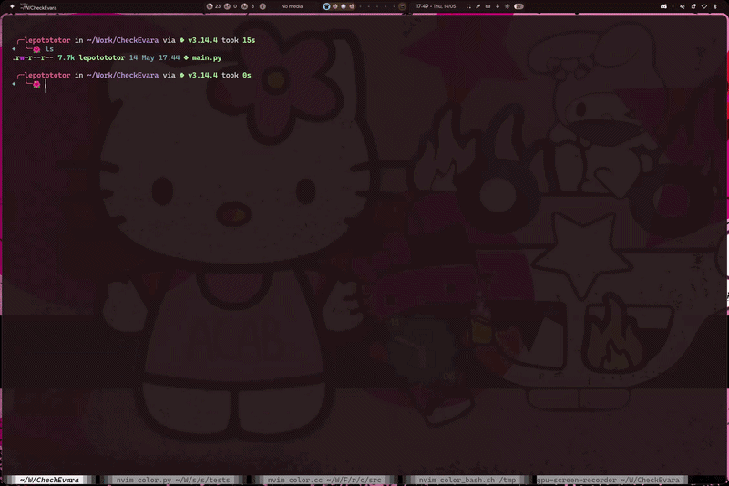

# CheckEvara

## Usage
CheckEvara is a python script that is able to get your moodle courses and then get all Check Presence for a class. Then it will launch a notification daemon who will send you notifications for each Check Presence

The program will send you a notification to inform you that the notification daemon started

It will also add to fake Check Presence, one 15 seconds after notification daemon start and another 1 minute after

It can be used as follow:
```bash
./check-evara.py
```

The logs are available at `/tmp/CheckEvara.log`

## Depencies not on PIE
```bash
nix-shell -p python313Packages.beautifulsoup4 python313Packages.requests libnotify
```

### It ask you your Moodle Session Cookie, you can watch the following example to see how to get it:



## Development Milestones
- [x] Moodle data handling
- [x] Notification daemon
- [x] Notifications creation
- [x] Specific image for checks
- [ ] Remove dependencies not on PIE or inject them
- [ ] Add notification action to close notif
- [ ] Restart daemon at session start on PIE
- [ ] Config to get info from last use
- [ ] Auto-log to moodle from kerberos
